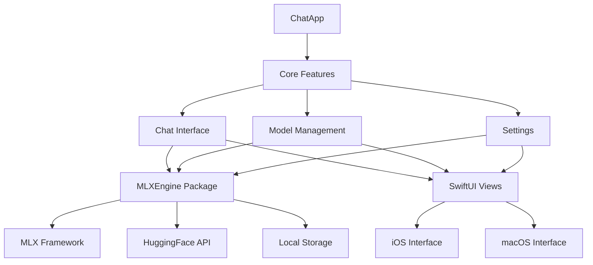

# MLXEngine Chat App Implementation Guide

> **Purpose**: Step-by-step guide to create a production-ready chat app using the MLXEngine Swift package  
> **Target**: Native iOS and macOS app with shared codebase  
> **Timeline**: 2-3 weeks for full implementation  
> **Skill Level**: Intermediate iOS/macOS development experience required

---

## Overview

This guide walks you through creating a complete chat application that leverages the MLXEngine Swift package for local LLM inference. The app will feature:

- **Cross-Platform**: Single codebase for iOS and macOS
- **Real-Time Chat**: Streaming responses with proper UI updates
- **Model Management**: Download, manage, and switch between models
- **Modern UI**: SwiftUI with adaptive layouts and design system
- **Performance**: Optimized for mobile hardware with memory management

---

## Architecture Overview



---

## Project Structure

```
MLXChatApp/
├── Package.swift
├── MLXChatApp.xcodeproj
├── Sources/
│   ├── MLXChatApp/
│   │   ├── MLXChatAppApp.swift          # Main app entry point
│   │   ├── ContentView.swift            # Root view with navigation
│   │   ├── Chat/
│   │   │   ├── ChatView.swift           # Main chat interface
│   │   │   ├── ChatViewModel.swift      # Chat business logic
│   │   │   ├── MessageBubble.swift      # Message UI component
│   │   │   └── ChatInputView.swift      # Message input component
│   │   ├── Models/
│   │   │   ├── ModelDiscoveryView.swift # Browse and search models
│   │   │   ├── ModelManager.swift       # Model management logic
│   │   │   └── ModelListView.swift      # Downloaded models list
│   │   ├── Settings/
│   │   │   ├── SettingsView.swift       # App settings
│   │   │   └── PreferencesView.swift    # Model preferences
│   │   ├── Design/
│   │   │   ├── ColorSystem.swift        # Design tokens
│   │   │   ├── Typography.swift         # Text styles
│   │   │   └── Components.swift         # Reusable UI components
│   │   └── Utils/
│   │       ├── AppLogger.swift          # Logging utilities
│   │       └── Extensions.swift         # Swift extensions
│   ├── iOS/
│   │   └── Info.plist                   # iOS configuration
│   └── macOS/
│       └── Info.plist                   # macOS configuration
├── Tests/
│   └── MLXChatAppTests/
└── README.md
```

---

## Phase 1: Project Setup (Days 1-2)

### 1.1 Create New Xcode Project

**Option A: Using Xcode**
1. Open Xcode → Create New Project
2. Choose "Multiplatform" → "App"
3. Product Name: `MLXChatApp`
4. Interface: SwiftUI
5. Language: Swift
6. Bundle Identifier: `com.yourcompany.mlxchatapp`

**Option B: Using Package.swift (Recommended)**

Create `Package.swift`:
```swift
// swift-tools-version: 5.9
import PackageDescription

let package = Package(
    name: "MLXChatApp",
    platforms: [
        .macOS(.v14), .iOS(.v17)
    ],
    products: [
        .executable(name: "MLXChatApp", targets: ["MLXChatApp"])
    ],
    dependencies: [
        // MLXEngine package (once published)
        .package(url: "https://github.com/yourusername/MLXEngine", from: "1.0.0"),
        // Or local development
        .package(path: "../MLXEngine")
    ],
    targets: [
        .executableTarget(
            name: "MLXChatApp",
            dependencies: ["MLXEngine"],
            path: "Sources/MLXChatApp",
            swiftSettings: [
                .enableExperimentalFeature("StrictConcurrency")
            ]
        ),
        .testTarget(
            name: "MLXChatAppTests",
            dependencies: ["MLXChatApp"]
        )
    ]
)
```

### 1.2 Basic App Structure

Create `Sources/MLXChatApp/MLXChatAppApp.swift`:
```swift
import SwiftUI
import MLXEngine

@main
struct MLXChatAppApp: App {
    init() {
        // Initialize logging
        AppLogger.setup()
    }
    
    var body: some Scene {
        #if os(macOS)
        WindowGroup {
            ContentView()
        }
        .defaultSize(width: 1000, height: 700)
        .windowResizability(.contentSize)
        #else
        WindowGroup {
            ContentView()
        }
        #endif
    }
}
```

Create `Sources/MLXChatApp/ContentView.swift`:
```swift
import SwiftUI

struct ContentView: View {
    @State private var selectedTab = 0
    
    var body: some View {
        #if os(iOS)
        TabView(selection: $selectedTab) {
            ChatView()
                .tabItem {
                    Image(systemName: "message")
                    Text("Chat")
                }
                .tag(0)
            
            ModelDiscoveryView()
                .tabItem {
                    Image(systemName: "square.and.arrow.down")
                    Text("Models")
                }
                .tag(1)
            
            SettingsView()
                .tabItem {
                    Image(systemName: "gear")
                    Text("Settings")
                }
                .tag(2)
        }
        #else
        NavigationSplitView {
            SidebarView(selectedTab: $selectedTab)
        } detail: {
            switch selectedTab {
            case 0:
                ChatView()
            case 1:
                ModelDiscoveryView()
            case 2:
                SettingsView()
            default:
                ChatView()
            }
        }
        #endif
    }
}

#if os(macOS)
struct SidebarView: View {
    @Binding var selectedTab: Int
    
    var body: some View {
        List(selection: $selectedTab) {
            NavigationLink(destination: ChatView()) {
                Label("Chat", systemImage: "message")
            }
            .tag(0)
            
            NavigationLink(destination: ModelDiscoveryView()) {
                Label("Models", systemImage: "square.and.arrow.down")
            }
            .tag(1)
            
            NavigationLink(destination: SettingsView()) {
                Label("Settings", systemImage: "gear")
            }
            .tag(2)
        }
        .navigationTitle("MLX Chat")
    }
}
#endif
```

---

## Phase 2: Chat Interface (Days 3-5)

### 2.1 Chat Message Model

Create `Sources/MLXChatApp/Chat/ChatMessage.swift`:
```swift
import Foundation

struct ChatMessage: Identifiable, Codable, Hashable {
    let id = UUID()
    let content: String
    let isUser: Bool
    let timestamp: Date
    let modelName: String?
    
    init(content: String, isUser: Bool, modelName: String? = nil) {
        self.content = content
        self.isUser = isUser
        self.timestamp = Date()
        self.modelName = modelName
    }
}

extension ChatMessage {
    static let examples: [ChatMessage] = [
        ChatMessage(content: "Hello! How can you help me today?", isUser: true),
        ChatMessage(content: "Hi there! I'm an AI assistant powered by MLX. I can help you with questions, writing, coding, analysis, and many other tasks. What would you like to work on?", isUser: false, modelName: "Qwen 0.5B")
    ]
}
```

### 2.2 Chat ViewModel

Create `Sources/MLXChatApp/Chat/ChatViewModel.swift`:
```swift
import Foundation
import MLXEngine
import os.log

@MainActor
@Observable
class ChatViewModel {
    private let logger = Logger(subsystem: "com.mlxchatapp", category: "ChatViewModel")
    
    // Public state
    var messages: [ChatMessage] = []
    var inputText: String = ""
    var isGenerating: Bool = false
    var streamingText: String = ""
    var selectedModel: ModelConfiguration?
    var availableModels: [ModelConfiguration] = []
    var errorMessage: String?
    
    // Private state
    private var chatSession: ChatSession?
    private var currentGenerationTask: Task<Void, Never>?
    
    init() {
        Task {
            await loadAvailableModels()
        }
    }
    
    // MARK: - Model Management
    
    func loadAvailableModels() async {
        do {
            let models = try await ModelRegistry.shared.getDownloadedModels()
            await MainActor.run {
                self.availableModels = models
                if self.selectedModel == nil {
                    self.selectedModel = models.first
                }
            }
        } catch {
            logger.error("Failed to load models: \(error.localizedDescription)")
            await MainActor.run {
                self.errorMessage = "Failed to load models: \(error.localizedDescription)"
            }
        }
    }
    
    func selectModel(_ model: ModelConfiguration) async {
        guard selectedModel?.id != model.id else { return }
        
        selectedModel = model
        chatSession = nil // Reset chat session
        
        // Add system message about model change
        let systemMessage = ChatMessage(
            content: "Switched to \(model.name)",
            isUser: false,
            modelName: model.name
        )
        messages.append(systemMessage)
    }
    
    // MARK: - Chat Operations
    
    func sendMessage() async {
        let prompt = inputText.trimmingCharacters(in: .whitespacesAndNewlines)
        guard !prompt.isEmpty, let model = selectedModel else { return }
        
        // Clear input and add user message
        inputText = ""
        let userMessage = ChatMessage(content: prompt, isUser: true)
        messages.append(userMessage)
        
        // Generate response
        await generateResponse(prompt: prompt, model: model)
    }
    
    private func generateResponse(prompt: String, model: ModelConfiguration) async {
        isGenerating = true
        streamingText = ""
        errorMessage = nil
        
        // Cancel any existing generation
        currentGenerationTask?.cancel()
        
        currentGenerationTask = Task {
            do {
                // Initialize chat session if needed
                if chatSession == nil {
                    chatSession = try await ChatSession.create(model: model)
                }
                
                guard let session = chatSession else {
                    throw ChatError.sessionNotInitialized
                }
                
                // Stream the response
                var fullResponse = ""
                for try await chunk in session.stream(prompt) {
                    guard !Task.isCancelled else { break }
                    
                    await MainActor.run {
                        self.streamingText += chunk
                        fullResponse += chunk
                    }
                }
                
                // Add complete message
                if !Task.isCancelled && !fullResponse.isEmpty {
                    let aiMessage = ChatMessage(
                        content: fullResponse,
                        isUser: false,
                        modelName: model.name
                    )
                    
                    await MainActor.run {
                        self.messages.append(aiMessage)
                        self.streamingText = ""
                        self.isGenerating = false
                    }
                }
                
            } catch {
                logger.error("Generation failed: \(error.localizedDescription)")
                await MainActor.run {
                    self.errorMessage = "Failed to generate response: \(error.localizedDescription)"
                    self.isGenerating = false
                    self.streamingText = ""
                }
            }
        }
    }
    
    func stopGeneration() {
        currentGenerationTask?.cancel()
        isGenerating = false
        streamingText = ""
    }
    
    func clearMessages() {
        messages.removeAll()
        chatSession = nil
    }
    
    func clearError() {
        errorMessage = nil
    }
}

enum ChatError: LocalizedError {
    case sessionNotInitialized
    case modelNotAvailable
    
    var errorDescription: String? {
        switch self {
        case .sessionNotInitialized:
            return "Chat session not initialized"
        case .modelNotAvailable:
            return "Selected model is not available"
        }
    }
}
```

### 2.3 Message Bubble Component

Create `Sources/MLXChatApp/Chat/MessageBubble.swift`:
```swift
import SwiftUI

struct MessageBubble: View {
    let message: ChatMessage
    let isStreaming: Bool
    
    init(message: ChatMessage, isStreaming: Bool = false) {
        self.message = message
        self.isStreaming = isStreaming
    }
    
    var body: some View {
        HStack {
            if message.isUser {
                Spacer(minLength: 60)
                messageContent
            } else {
                messageContent
                Spacer(minLength: 60)
            }
        }
        .padding(.horizontal)
        .padding(.vertical, 4)
    }
    
    private var messageContent: some View {
        VStack(alignment: message.isUser ? .trailing : .leading, spacing: 4) {
            HStack {
                if !message.isUser {
                    Image(systemName: "cpu")
                        .foregroundStyle(.secondary)
                        .font(.caption)
                }
                
                Text(message.isUser ? "You" : (message.modelName ?? "Assistant"))
                    .font(.caption)
                    .foregroundStyle(.secondary)
                
                if message.isUser {
                    Image(systemName: "person.circle.fill")
                        .foregroundStyle(.blue)
                        .font(.caption)
                }
            }
            
            HStack {
                Text(message.content)
                    .textSelection(.enabled)
                    .padding(12)
                    .background(
                        RoundedRectangle(cornerRadius: 16)
                            .fill(message.isUser ? .blue : .gray.opacity(0.1))
                    )
                    .foregroundStyle(message.isUser ? .white : .primary)
                
                if isStreaming {
                    ProgressView()
                        .scaleEffect(0.8)
                }
            }
            
            HStack {
                Text(message.timestamp.formatted(date: .omitted, time: .shortened))
                    .font(.caption2)
                    .foregroundStyle(.tertiary)
                
                if !message.isUser && !isStreaming {
                    Button {
                        copyToClipboard(message.content)
                    } label: {
                        Image(systemName: "doc.on.doc")
                            .font(.caption2)
                    }
                    .buttonStyle(.plain)
                    .foregroundStyle(.secondary)
                }
            }
        }
    }
    
    private func copyToClipboard(_ text: String) {
        #if os(macOS)
        NSPasteboard.general.clearContents()
        NSPasteboard.general.setString(text, forType: .string)
        #else
        UIPasteboard.general.string = text
        #endif
    }
}

#Preview {
    VStack {
        MessageBubble(message: ChatMessage.examples[0])
        MessageBubble(message: ChatMessage.examples[1])
        MessageBubble(
            message: ChatMessage(content: "This is a streaming message...", isUser: false),
            isStreaming: true
        )
    }
    .padding()
}
```

### 2.4 Chat Input Component

Create `Sources/MLXChatApp/Chat/ChatInputView.swift`:
```swift
import SwiftUI

struct ChatInputView: View {
    @Binding var text: String
    @Binding var isGenerating: Bool
    let onSend: () async -> Void
    let onStop: () -> Void
    
    @State private var isExpanded = false
    @FocusState private var isTextFieldFocused: Bool
    
    var body: some View {
        VStack(spacing: 12) {
            HStack(alignment: .bottom, spacing: 12) {
                VStack(alignment: .leading, spacing: 8) {
                    if isExpanded {
                        TextEditor(text: $text)
                            .focused($isTextFieldFocused)
                            .frame(minHeight: 60, maxHeight: 120)
                            .scrollContentBackground(.hidden)
                            .background(.clear)
                    } else {
                        TextField("Type a message...", text: $text, axis: .vertical)
                            .focused($isTextFieldFocused)
                            .lineLimit(1...4)
                    }
                }
                .padding(12)
                .background(
                    RoundedRectangle(cornerRadius: 20)
                        .fill(.gray.opacity(0.1))
                )
                .overlay(
                    RoundedRectangle(cornerRadius: 20)
                        .stroke(.gray.opacity(0.2), lineWidth: 1)
                )
                
                VStack(spacing: 8) {
                    Button {
                        isExpanded.toggle()
                    } label: {
                        Image(systemName: isExpanded ? "arrow.down.right.and.arrow.up.left" : "arrow.up.left.and.arrow.down.right")
                            .font(.system(size: 14))
                            .foregroundStyle(.secondary)
                    }
                    .buttonStyle(.plain)
                    
                    if isGenerating {
                        Button {
                            onStop()
                        } label: {
                            Image(systemName: "stop.circle.fill")
                                .font(.title2)
                                .foregroundStyle(.red)
                        }
                        .buttonStyle(.plain)
                    } else {
                        Button {
                            Task {
                                await onSend()
                            }
                        } label: {
                            Image(systemName: "arrow.up.circle.fill")
                                .font(.title2)
                                .foregroundStyle(text.trimmingCharacters(in: .whitespacesAndNewlines).isEmpty ? .gray : .blue)
                        }
                        .buttonStyle(.plain)
                        .disabled(text.trimmingCharacters(in: .whitespacesAndNewlines).isEmpty)
                    }
                }
            }
        }
        .padding()
        .background(.ultraThinMaterial)
        .onSubmit {
            if !isGenerating && !text.trimmingCharacters(in: .whitespacesAndNewlines).isEmpty {
                Task {
                    await onSend()
                }
            }
        }
    }
}

#Preview {
    VStack {
        Spacer()
        ChatInputView(
            text: .constant("Sample message"),
            isGenerating: .constant(false),
            onSend: {},
            onStop: {}
        )
    }
}
```

### 2.5 Main Chat View

Create `Sources/MLXChatApp/Chat/ChatView.swift`:
```swift
import SwiftUI

struct ChatView: View {
    @State private var viewModel = ChatViewModel()
    
    var body: some View {
        VStack(spacing: 0) {
            // Header
            headerView
            
            Divider()
            
            // Messages
            messagesView
            
            // Input
            ChatInputView(
                text: $viewModel.inputText,
                isGenerating: $viewModel.isGenerating,
                onSend: {
                    await viewModel.sendMessage()
                },
                onStop: {
                    viewModel.stopGeneration()
                }
            )
        }
        .navigationTitle("Chat")
        .navigationBarTitleDisplayMode(.inline)
        .alert("Error", isPresented: .constant(viewModel.errorMessage != nil)) {
            Button("OK") {
                viewModel.clearError()
            }
        } message: {
            if let error = viewModel.errorMessage {
                Text(error)
            }
        }
        .task {
            await viewModel.loadAvailableModels()
        }
    }
    
    private var headerView: some View {
        HStack {
            VStack(alignment: .leading) {
                Text("MLX Chat")
                    .font(.headline)
                
                if let model = viewModel.selectedModel {
                    Text(model.name)
                        .font(.caption)
                        .foregroundStyle(.secondary)
                } else {
                    Text("No model selected")
                        .font(.caption)
                        .foregroundStyle(.red)
                }
            }
            
            Spacer()
            
            Menu {
                ForEach(viewModel.availableModels, id: \.id) { model in
                    Button {
                        Task {
                            await viewModel.selectModel(model)
                        }
                    } label: {
                        HStack {
                            Text(model.name)
                            if model.id == viewModel.selectedModel?.id {
                                Image(systemName: "checkmark")
                            }
                        }
                    }
                }
                
                Divider()
                
                Button {
                    viewModel.clearMessages()
                } label: {
                    Label("Clear Chat", systemImage: "trash")
                }
            } label: {
                Image(systemName: "ellipsis.circle")
                    .font(.title2)
            }
        }
        .padding()
        .background(.ultraThinMaterial)
    }
    
    private var messagesView: some View {
        ScrollViewReader { proxy in
            ScrollView {
                LazyVStack(spacing: 8) {
                    if viewModel.messages.isEmpty {
                        emptyStateView
                    } else {
                        ForEach(viewModel.messages) { message in
                            MessageBubble(message: message)
                                .id(message.id)
                        }
                        
                        // Streaming message
                        if viewModel.isGenerating && !viewModel.streamingText.isEmpty {
                            MessageBubble(
                                message: ChatMessage(
                                    content: viewModel.streamingText,
                                    isUser: false,
                                    modelName: viewModel.selectedModel?.name
                                ),
                                isStreaming: true
                            )
                            .id("streaming")
                        }
                    }
                }
                .padding(.top)
            }
            .onChange(of: viewModel.messages.count) { _, _ in
                withAnimation(.easeOut(duration: 0.3)) {
                    proxy.scrollTo(viewModel.messages.last?.id, anchor: .bottom)
                }
            }
            .onChange(of: viewModel.streamingText) { _, _ in
                withAnimation(.easeOut(duration: 0.1)) {
                    proxy.scrollTo("streaming", anchor: .bottom)
                }
            }
        }
    }
    
    private var emptyStateView: some View {
        VStack(spacing: 16) {
            Image(systemName: "message.circle")
                .font(.system(size: 60))
                .foregroundStyle(.secondary)
            
            VStack(spacing: 8) {
                Text("Start a conversation")
                    .font(.title2)
                    .fontWeight(.medium)
                
                Text("Send a message to begin chatting with your local AI model")
                    .font(.body)
                    .foregroundStyle(.secondary)
                    .multilineTextAlignment(.center)
            }
            
            if viewModel.selectedModel == nil {
                Button {
                    // Navigate to model selection
                } label: {
                    Label("Download Models", systemImage: "square.and.arrow.down")
                }
                .buttonStyle(.borderedProminent)
            }
        }
        .padding()
        .frame(maxWidth: 300)
    }
}

#Preview {
    NavigationStack {
        ChatView()
    }
}
```

---

## Phase 3: Model Management (Days 6-8)

### 3.1 Model Discovery View

Create `Sources/MLXChatApp/Models/ModelDiscoveryView.swift`:
```swift
import SwiftUI
import MLXEngine

struct ModelDiscoveryView: View {
    @State private var searchText = ""
    @State private var selectedCategory: ModelCategory = .all
    @State private var availableModels: [HuggingFaceModel] = []
    @State private var isSearching = false
    @State private var errorMessage: String?
    
    private let huggingFaceAPI = HuggingFaceAPI.shared
    
    var body: some View {
        NavigationStack {
            VStack(spacing: 0) {
                // Search and filters
                searchHeader
                
                Divider()
                
                // Model list
                modelList
            }
            .navigationTitle("Discover Models")
            .navigationBarTitleDisplayMode(.large)
            .task {
                await searchModels()
            }
        }
    }
    
    private var searchHeader: some View {
        VStack(spacing: 12) {
            HStack {
                TextField("Search models...", text: $searchText)
                    .textFieldStyle(.roundedBorder)
                    .onSubmit {
                        Task {
                            await searchModels()
                        }
                    }
                
                Button {
                    Task {
                        await searchModels()
                    }
                } label: {
                    Image(systemName: "magnifyingglass")
                }
                .disabled(isSearching)
            }
            
            ScrollView(.horizontal, showsIndicators: false) {
                HStack(spacing: 8) {
                    ForEach(ModelCategory.allCases, id: \.self) { category in
                        Button {
                            selectedCategory = category
                            Task {
                                await searchModels()
                            }
                        } label: {
                            Text(category.displayName)
                                .font(.caption)
                                .padding(.horizontal, 12)
                                .padding(.vertical, 6)
                                .background(
                                    RoundedRectangle(cornerRadius: 12)
                                        .fill(selectedCategory == category ? .blue : .gray.opacity(0.2))
                                )
                                .foregroundStyle(selectedCategory == category ? .white : .primary)
                        }
                        .buttonStyle(.plain)
                    }
                }
                .padding(.horizontal)
            }
        }
        .padding()
        .background(.ultraThinMaterial)
    }
    
    private var modelList: some View {
        Group {
            if isSearching {
                ProgressView("Searching models...")
                    .frame(maxWidth: .infinity, maxHeight: .infinity)
            } else if availableModels.isEmpty {
                emptyStateView
            } else {
                List(availableModels, id: \.id) { model in
                    ModelRowView(model: model) {
                        await downloadModel(model)
                    }
                }
            }
        }
        .alert("Error", isPresented: .constant(errorMessage != nil)) {
            Button("OK") {
                errorMessage = nil
            }
        } message: {
            if let error = errorMessage {
                Text(error)
            }
        }
    }
    
    private var emptyStateView: some View {
        VStack(spacing: 16) {
            Image(systemName: "square.and.arrow.down")
                .font(.system(size: 60))
                .foregroundStyle(.secondary)
            
            VStack(spacing: 8) {
                Text("No models found")
                    .font(.title2)
                    .fontWeight(.medium)
                
                Text("Try adjusting your search terms or category filter")
                    .font(.body)
                    .foregroundStyle(.secondary)
                    .multilineTextAlignment(.center)
            }
        }
        .padding()
        .frame(maxWidth: .infinity, maxHeight: .infinity)
    }
    
    private func searchModels() async {
        isSearching = true
        errorMessage = nil
        
        do {
            let query = searchText.isEmpty ? selectedCategory.searchQuery : searchText
            let models = try await huggingFaceAPI.searchModels(query: query, limit: 50)
            
            await MainActor.run {
                self.availableModels = models
                self.isSearching = false
            }
        } catch {
            await MainActor.run {
                self.errorMessage = "Failed to search models: \(error.localizedDescription)"
                self.isSearching = false
            }
        }
    }
    
    private func downloadModel(_ model: HuggingFaceModel) async {
        // Implementation for model download
        // This would integrate with MLXEngine's download functionality
    }
}

struct ModelRowView: View {
    let model: HuggingFaceModel
    let onDownload: () async -> Void
    
    var body: some View {
        VStack(alignment: .leading, spacing: 8) {
            HStack {
                VStack(alignment: .leading, spacing: 4) {
                    Text(model.id)
                        .font(.headline)
                        .lineLimit(2)
                    
                    if let description = model.description {
                        Text(description)
                            .font(.caption)
                            .foregroundStyle(.secondary)
                            .lineLimit(3)
                    }
                }
                
                Spacer()
                
                Button {
                    Task {
                        await onDownload()
                    }
                } label: {
                    Image(systemName: "square.and.arrow.down")
                }
                .buttonStyle(.borderedProminent)
            }
            
            HStack {
                if let downloads = model.downloads {
                    Label("\(downloads)", systemImage: "arrow.down.circle")
                        .font(.caption2)
                        .foregroundStyle(.secondary)
                }
                
                if let likes = model.likes {
                    Label("\(likes)", systemImage: "heart")
                        .font(.caption2)
                        .foregroundStyle(.secondary)
                }
                
                Spacer()
                
                if let tags = model.tags {
                    ForEach(tags.prefix(2), id: \.self) { tag in
                        Text(tag)
                            .font(.caption2)
                            .padding(.horizontal, 6)
                            .padding(.vertical, 2)
                            .background(.blue.opacity(0.1))
                            .foregroundStyle(.blue)
                            .clipShape(Capsule())
                    }
                }
            }
        }
        .padding(.vertical, 4)
    }
}

enum ModelCategory: CaseIterable {
    case all
    case chat
    case coding
    case small
    case multilingual
    
    var displayName: String {
        switch self {
        case .all: return "All"
        case .chat: return "Chat"
        case .coding: return "Coding"
        case .small: return "Small"
        case .multilingual: return "Multilingual"
        }
    }
    
    var searchQuery: String {
        switch self {
        case .all: return "mlx"
        case .chat: return "mlx chat"
        case .coding: return "mlx code"
        case .small: return "mlx 0.5b 1b 3b"
        case .multilingual: return "mlx multilingual"
        }
    }
}

#Preview {
    ModelDiscoveryView()
}
```

---

## Phase 4: Settings and Configuration (Days 9-10)

### 4.1 Settings View

Create `Sources/MLXChatApp/Settings/SettingsView.swift`:
```swift
import SwiftUI
import MLXEngine

struct SettingsView: View {
    @AppStorage("maxTokens") private var maxTokens: Double = 2048
    @AppStorage("temperature") private var temperature: Double = 0.7
    @AppStorage("enableLogging") private var enableLogging = true
    @AppStorage("downloadPath") private var downloadPath = ""
    
    var body: some View {
        NavigationStack {
            Form {
                Section("Generation Settings") {
                    VStack(alignment: .leading, spacing: 8) {
                        HStack {
                            Text("Max Tokens")
                            Spacer()
                            Text("\(Int(maxTokens))")
                                .foregroundStyle(.secondary)
                        }
                        
                        Slider(value: $maxTokens, in: 100...4096, step: 100)
                    }
                    
                    VStack(alignment: .leading, spacing: 8) {
                        HStack {
                            Text("Temperature")
                            Spacer()
                            Text(String(format: "%.2f", temperature))
                                .foregroundStyle(.secondary)
                        }
                        
                        Slider(value: $temperature, in: 0.1...2.0, step: 0.1)
                    }
                }
                
                Section("App Settings") {
                    Toggle("Enable Logging", isOn: $enableLogging)
                    
                    #if os(macOS)
                    HStack {
                        Text("Download Path")
                        Spacer()
                        Button("Choose...") {
                            chooseDownloadPath()
                        }
                    }
                    
                    if !downloadPath.isEmpty {
                        Text(downloadPath)
                            .font(.caption)
                            .foregroundStyle(.secondary)
                    }
                    #endif
                }
                
                Section("About") {
                    HStack {
                        Text("Version")
                        Spacer()
                        Text("1.0.0")
                            .foregroundStyle(.secondary)
                    }
                    
                    HStack {
                        Text("MLXEngine Version")
                        Spacer()
                        Text("1.0.0")
                            .foregroundStyle(.secondary)
                    }
                    
                    Link("GitHub Repository", destination: URL(string: "https://github.com/yourusername/MLXChatApp")!)
                }
            }
            .navigationTitle("Settings")
        }
    }
    
    #if os(macOS)
    private func chooseDownloadPath() {
        let panel = NSOpenPanel()
        panel.canChooseDirectories = true
        panel.canChooseFiles = false
        panel.allowsMultipleSelection = false
        
        if panel.runModal() == .OK {
            if let url = panel.url {
                downloadPath = url.path
            }
        }
    }
    #endif
}

#Preview {
    SettingsView()
}
```

---

## Phase 5: Design System (Days 11-12)

### 5.1 Color System

Create `Sources/MLXChatApp/Design/ColorSystem.swift`:
```swift
import SwiftUI

extension Color {
    // Primary colors
    static let primaryBlue = Color("PrimaryBlue", bundle: .main)
    static let primaryGreen = Color("PrimaryGreen", bundle: .main)
    
    // Semantic colors
    static let chatUserBubble = Color.blue
    static let chatAssistantBubble = Color(.systemGray6)
    static let chatInputBackground = Color(.systemGray6)
    
    // Status colors
    static let successGreen = Color.green
    static let warningOrange = Color.orange
    static let errorRed = Color.red
    
    // Utility function to create colors with fallbacks
    static func dynamicColor(light: Color, dark: Color) -> Color {
        Color(UIColor { traitCollection in
            traitCollection.userInterfaceStyle == .dark ? UIColor(dark) : UIColor(light)
        })
    }
}

// Gradient definitions
extension LinearGradient {
    static let primaryGradient = LinearGradient(
        colors: [.blue, .purple],
        startPoint: .topLeading,
        endPoint: .bottomTrailing
    )
    
    static let accentGradient = LinearGradient(
        colors: [.green, .blue],
        startPoint: .leading,
        endPoint: .trailing
    )
}
```

### 5.2 Typography System

Create `Sources/MLXChatApp/Design/Typography.swift`:
```swift
import SwiftUI

extension Font {
    // Heading styles
    static let largeTitle = Font.largeTitle.weight(.bold)
    static let title1 = Font.title.weight(.semibold)
    static let title2 = Font.title2.weight(.semibold)
    static let title3 = Font.title3.weight(.medium)
    
    // Body styles
    static let bodyLarge = Font.body.weight(.medium)
    static let bodyRegular = Font.body
    static let bodySmall = Font.callout
    
    // Specialty styles
    static let code = Font.system(.body, design: .monospaced)
    static let caption = Font.caption
    static let chatTimestamp = Font.caption2.weight(.medium)
}

// Text style modifiers
extension Text {
    func primaryHeading() -> some View {
        self
            .font(.largeTitle)
            .fontWeight(.bold)
            .foregroundStyle(.primary)
    }
    
    func secondaryHeading() -> some View {
        self
            .font(.title2)
            .fontWeight(.semibold)
            .foregroundStyle(.primary)
    }
    
    func bodyText() -> some View {
        self
            .font(.body)
            .foregroundStyle(.primary)
    }
    
    func captionText() -> some View {
        self
            .font(.caption)
            .foregroundStyle(.secondary)
    }
    
    func codeText() -> some View {
        self
            .font(.code)
            .padding(.horizontal, 4)
            .padding(.vertical, 2)
            .background(.gray.opacity(0.1))
            .clipShape(RoundedRectangle(cornerRadius: 4))
    }
}
```

---

## Phase 6: Testing and Polish (Days 13-14)

### 6.1 Unit Tests

Create `Tests/MLXChatAppTests/ChatViewModelTests.swift`:
```swift
import XCTest
@testable import MLXChatApp

final class ChatViewModelTests: XCTestCase {
    
    @MainActor
    func testInitialState() {
        let viewModel = ChatViewModel()
        
        XCTAssertTrue(viewModel.messages.isEmpty)
        XCTAssertTrue(viewModel.inputText.isEmpty)
        XCTAssertFalse(viewModel.isGenerating)
        XCTAssertNil(viewModel.selectedModel)
    }
    
    @MainActor
    func testMessageHandling() {
        let viewModel = ChatViewModel()
        let testMessage = ChatMessage(content: "Test message", isUser: true)
        
        viewModel.messages.append(testMessage)
        
        XCTAssertEqual(viewModel.messages.count, 1)
        XCTAssertEqual(viewModel.messages.first?.content, "Test message")
        XCTAssertTrue(viewModel.messages.first?.isUser == true)
    }
    
    @MainActor
    func testClearMessages() {
        let viewModel = ChatViewModel()
        viewModel.messages.append(ChatMessage(content: "Test", isUser: true))
        
        viewModel.clearMessages()
        
        XCTAssertTrue(viewModel.messages.isEmpty)
    }
}
```

### 6.2 Integration Tests

Create `Tests/MLXChatAppTests/MLXEngineIntegrationTests.swift`:
```swift
import XCTest
import MLXEngine
@testable import MLXChatApp

final class MLXEngineIntegrationTests: XCTestCase {
    
    func testModelRegistryConnection() async throws {
        let models = try await ModelRegistry.shared.getAvailableModels()
        XCTAssertFalse(models.isEmpty, "Should have at least some default models")
    }
    
    func testHuggingFaceAPIConnection() async throws {
        let api = HuggingFaceAPI.shared
        let models = try await api.searchModels(query: "mlx", limit: 5)
        XCTAssertFalse(models.isEmpty, "Should find MLX models")
    }
}
```

---

## Phase 7: Deployment Preparation (Days 15-16)

### 7.1 App Icons and Assets

Create app icons for both platforms:
- iOS: 1024x1024 App Store icon
- macOS: 1024x1024 Mac App Store icon

Add to `Sources/Assets.xcassets/AppIcon.appiconset/`

### 7.2 Info.plist Configuration

`Sources/iOS/Info.plist`:
```xml
<?xml version="1.0" encoding="UTF-8"?>
<!DOCTYPE plist PUBLIC "-//Apple//DTD PLIST 1.0//EN" "http://www.apple.com/DTDs/PropertyList-1.0.dtd">
<plist version="1.0">
<dict>
    <key>CFBundleDisplayName</key>
    <string>MLX Chat</string>
    <key>CFBundleIdentifier</key>
    <string>$(PRODUCT_BUNDLE_IDENTIFIER)</string>
    <key>CFBundleVersion</key>
    <string>$(CURRENT_PROJECT_VERSION)</string>
    <key>CFBundleShortVersionString</key>
    <string>$(MARKETING_VERSION)</string>
    <key>LSRequiresIPhoneOS</key>
    <true/>
    <key>UIRequiredDeviceCapabilities</key>
    <array>
        <string>armv7</string>
    </array>
    <key>UISupportedInterfaceOrientations</key>
    <array>
        <string>UIInterfaceOrientationPortrait</string>
        <string>UIInterfaceOrientationLandscapeLeft</string>
        <string>UIInterfaceOrientationLandscapeRight</string>
    </array>
    <key>UILaunchScreen</key>
    <dict/>
</dict>
</plist>
```

`Sources/macOS/Info.plist`:
```xml
<?xml version="1.0" encoding="UTF-8"?>
<!DOCTYPE plist PUBLIC "-//Apple//DTD PLIST 1.0//EN" "http://www.apple.com/DTDs/PropertyList-1.0.dtd">
<plist version="1.0">
<dict>
    <key>CFBundleDisplayName</key>
    <string>MLX Chat</string>
    <key>CFBundleIdentifier</key>
    <string>$(PRODUCT_BUNDLE_IDENTIFIER)</string>
    <key>CFBundleVersion</key>
    <string>$(CURRENT_PROJECT_VERSION)</string>
    <key>CFBundleShortVersionString</key>
    <string>$(MARKETING_VERSION)</string>
    <key>LSMinimumSystemVersion</key>
    <string>14.0</string>
    <key>NSPrincipalClass</key>
    <string>NSApplication</string>
    <key>NSHumanReadableCopyright</key>
    <string>Copyright © 2025 Your Company. All rights reserved.</string>
</dict>
</plist>
```

---

## GitHub Repository Setup

To enable distribution as a Swift Package Manager dependency, you'll need to set up a GitHub repository for the MLXEngine package.

### Repository Structure

```
MLXEngine/
├── Package.swift
├── README.md
├── LICENSE
├── Sources/
│   └── MLXEngine/
├── Tests/
│   └── MLXEngineTests/
├── Examples/
│   ├── simple_example.swift
│   └── interactive_prompt.swift
├── Documentation/
│   ├── API_Reference.md
│   ├── Getting_Started.md
│   └── Advanced_Usage.md
└── .github/
    └── workflows/
        └── ci.yml
```

### Next Actions Required

1. **Create GitHub Repository**
   - Create a new public repository: `github.com/yourusername/MLXEngine`
   - Add comprehensive README with installation and usage instructions
   - Include MIT or Apache 2.0 license
   - Set up GitHub Actions for CI/CD

2. **Package Distribution**
   - Tag stable releases (v1.0.0, v1.0.1, etc.)
   - Create detailed release notes
   - Test package integration with sample projects

3. **Documentation**
   - DocC documentation generation
   - Swift Package Index submission
   - Example projects and tutorials

Would you like me to help you set up the GitHub repository with all the necessary files, CI/CD workflows, and documentation?

---

*Last updated: 2025-01-27* 